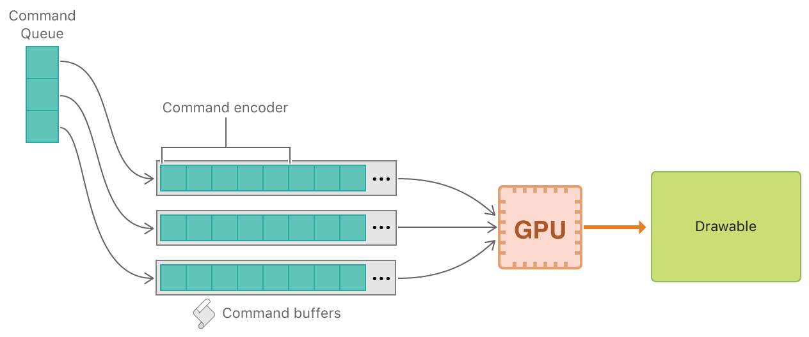

# Devices and Commands

Demonstrates how to access and interact with the GPU.

## Overview

Metal provides low-level, low-overhead access to the graphics processing unit (GPU) of a user's device, resulting in great apps that use the GPU efficiently. The key to developing such an app is understanding the underlying software and hardware interactions holistically.

In this sample, you'll learn how to write an app that uses Metal and issues basic rendering commands to the GPU. In particular, you'll learn how to obtain a Metal device, configure a MetalKit view, create and execute GPU commands, and display rendered content.

## Getting Started

The Xcode project contains schemes for running the sample on macOS, iOS, or tvOS. Metal is not supported in the iOS or tvOS Simulator, so the iOS and tvOS schemes require a physical device to run the sample. The default scheme is macOS, which runs the sample as is on your Mac.

## The Metal and MetalKit Frameworks

The sample uses two frameworks to display rendered content: Metal and MetalKit. Metal provides access to the GPU, and MetalKit provides common utilities that make it easier to develop a Metal app. Together they seamlessly integrate with the OS and with other frameworks, so you can focus on GPU programming.

One of MetalKit's most useful features is the `MTKView` class, which wraps `UIView` or `NSView` objects and configures Metal-specific Core Animation functionality. In particular, a MetalKit view automatically sets up and manages a continuous rendering loop that provides you with a 2D, displayable resource, commonly known as a *drawable*, for each frame.

- Note: You can use Core Animation directly to develop a Metal app, but it's easier, faster, and more convenient to use MetalKit.

## Separate Your Rendering Loop

When developing a Metal app, it's often useful to separate your rendering loop into its own class. Using a separate class, you can better manage your initial Metal setup code and per-frame Metal commands. This common architecture is demonstrated by the `AAPLRenderer` class, which is initialized with a MetalKit view and is assigned as the view's delegate.

``` objective-c
_renderer = [[AAPLRenderer alloc] initWithMetalKitView:_view];

if(!_renderer)
{
    NSLog(@"Renderer failed initialization");
    return;
}

_view.delegate = _renderer;
```

## Respond to View Events

A `MTKViewDelegate` object implements the `mtkView:drawableSizeWillChange:` and `drawInMTKView:` methods. These methods notify your renderer of the MetalKit view's resizing and drawing events.

* The view calls the `mtkView:drawableSizeWillChange:` method whenever the window size changes (macOS) or a relayout operation, such as a device orientation change, occurs (iOS and tvOS). You can then respond to the new size of the view and change your rendering resolution, if necessary.

* The view calls the `drawInMTKView:` method whenever it's time to render a new frame, as specified by the frame rate (for example, 60 FPS) set on the view's `preferredFramesPerSecond` property. This callback is typically the main event that begins the execution of your rendering loop.

## Metal Command Objects

A `MTLDevice` object represents a GPU. Typically, you call the `MTLCreateSystemDefaultDevice()` method to obtain a single `MTLDevice` object that represents the default GPU of a device. A `MTLDevice` object provides information about a GPU, but its main purpose is to create other objects that can interact with the GPU.

The first object all apps need to interact with the GPU is a `MTLCommandQueue` object.

``` objective-c
_commandQueue = [_device newCommandQueue];
```

You use a `MTLCommandQueue` object to create and organize `MTLCommandBuffer` objects, ensuring that they're sent to the GPU in the correct order.

For every frame, a new `MTLCommandBuffer` object is created and filled with commands that are executed by the GPU.

``` objective-c
id<MTLCommandBuffer> commandBuffer = [_commandQueue commandBuffer];
```

There are many different types of GPUs, each accepting and interpreting commands in their own unique way. A `MTLCommandBuffer` object coalesces these commands into a single submission, but they must first be encoded in a device-agnostic way using a `MTLCommandEncoder` object. There are a few different types of `MTLCommandEncoder` classes, each used to execute different types of tasks on the GPU. This sample demonstrates the use of a `MTLRenderCommandEncoder` subclass, which specifically encodes rendering commands into a command buffer.

This sample uses a `MTLRenderCommandEncoder` object to encode GPU commands that render pixels to the MetalKit view's drawable. To do so, the render command encoder must be specifically associated with this drawable.

To create a `MTLRenderCommandEncoder` object, you must first create a `MTLRenderPassDescriptor` object. A `MTLRenderPassDescriptor` is a lightweight, temporary object with a number of configurable properties that are used by an existing `MTLCommandBuffer` object to create a new `MTLRenderCommandEncoder` object. Afterward, the `MTLRenderPassDescriptor` object is no longer needed.

The following diagram illustrates the relationship between Metal's command objects. To summarize:
1. Command buffers are created from a command queue
2. Command encoders encode commands into command buffers
3. Command buffers are then committed and sent to the GPU
4. The GPU executes the commands and renders the results to a drawable



## Prepare a Frame

A MetalKit view creates a new `MTLRenderPassDescriptor` object for every frame, provided via the `currentRenderPassDescriptor` property. This render pass descriptor is preconfigured with view-specific properties, some derived from the view's drawable, and can be used to easily and conveniently create a new `MTLRenderCommandEncoder` object.

``` objective-c
// Obtain a render pass descriptor, generated from the view's drawable
MTLRenderPassDescriptor *renderPassDescriptor = view.currentRenderPassDescriptor;

// If you've successfully obtained a render pass descriptor, you can render to
// the drawable; otherwise you skip any rendering this frame because you have no
// drawable to draw to
if(renderPassDescriptor != nil)
{
    id<MTLRenderCommandEncoder> renderEncoder = [commandBuffer renderCommandEncoderWithDescriptor:renderPassDescriptor];
```

Commands encoded into this `MTLRenderCommandEncoder` object render to the view's drawable. By default, creating a `MTLRenderCommandEncoder` object implicitly encodes a clear command that the GPU executes before any other rendering commands. The clear command sets the drawable's pixels to a clear color that's updated at the start of the rendering loop.

``` objective-c
Color color = [self makeFancyColor];
view.clearColor = MTLClearColorMake(color.red, color.green, color.blue, color.alpha);
```

## Finalize a Frame

Typically, Metal apps call many `MTLRenderCommandEncoder` methods that encode explicit rendering commands into a command buffer. For simplicity, this sample doesn't actually encode explicit rendering commands; only the implicit clear command is encoded. After creating the `MTLRenderCommandEncoder` object, the sample simply calls the `endEncoding` method to indicate that the encoder is finalized.

When the encoder is finalized, the command buffer accepts two final commands: present and commit.

Because the GPU doesn’t draw directly to the screen, it’s prevented from drawing pixels before it has finished executing commands. To avoid a poor user experience resulting from incomplete drawables, you call the `presentDrawable:` method. This method tells Metal to wait for the GPU to finish rendering to a drawable before presenting it onscreen.

``` objective-c
[commandBuffer presentDrawable:view.currentDrawable];
```

The GPU also doesn't execute commands immediately. Calls to a `MTLRenderCommandEncoder` or `MTLCommandBuffer` object are executed only after the `commit` method is called. Metal then schedules the command buffer for execution. When the GPU begins execution, the drawable is cleared with a new color. When the GPU completes execution, the rendered drawable is presented onscreen.

``` objective-c
[commandBuffer commit];
```

## Next Steps
In this sample, you learned how to write an app that uses Metal and issues basic rendering commands to the GPU.

In the [Hello Triangle](https://developer.apple.com/documentation/metal/hello_triangle) sample, you'll learn how to render basic geometry in Metal.
