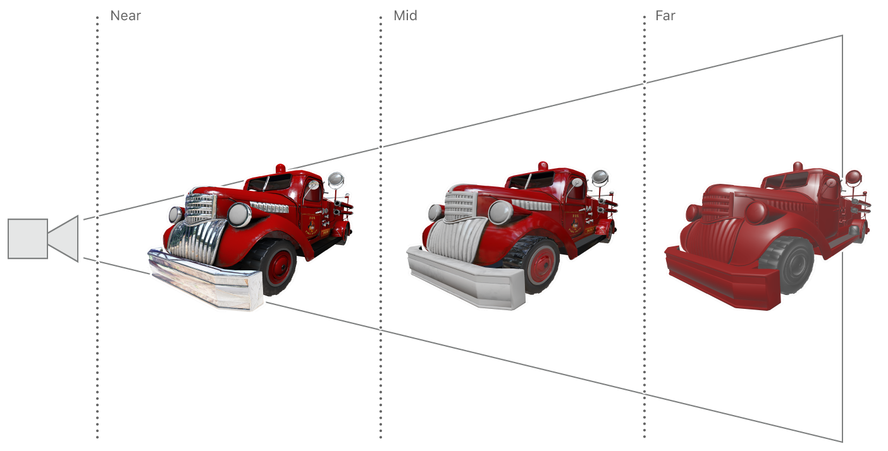

# LOD with Function Specialization

Demonstrates how to use specialized functions to select a level of detail based on dynamic conditions.

## Overview

A high-quality gaming experience has to manage trade-offs between great graphics and great performance. High-quality models look great, but their complexity requires a significant amount of processing power. By increasing or decreasing the level of detail (LOD) of a model, games can selectively manage both graphics and performance.


Instead of selecting a fixed LOD at build time, games can dynamically select between a range of LODs at runtime based on certain model-view conditions. For example, a focal-point foreground model could have a high LOD, whereas a fast-moving background model could have a low LOD.

This sample demonstrates dynamic LOD selection for a fire truck model, based on its distance from the scene's camera. When the model is closer to the camera, the renderer uses a higher LOD; when the model is further from the camera, the renderer uses a lower LOD.



## Getting Started

The Xcode project contains schemes for running the sample on macOS, iOS, or tvOS. Metal is not supported in the iOS or tvOS Simulator, so the iOS and tvOS schemes require a physical device to run the sample. The default scheme is macOS, which runs the sample as is on your Mac.

## GPU Branch Statements

Unlike CPU code, graphics processing unit (GPU) branch statements like `if` and `else` are very expensive. The massively parallel architecture of GPUs isn't particularly well suited to handling GPU functions that have many branches. More branches result in more register allocations and thus decrease the number of GPU threads that can execute concurrently. Nevertheless, branch statements are useful programming constructs, particularly for functions that share a lot of code. In fact, a common problem for graphics functions that share code is how to handle a branch condition that differs only between draw calls, not between individual threads executing within a single draw call.

Traditionally, branches that differ between draw calls are mitigated in one of these ways:

* Writing per-branch functions. Each branch is written as a complete and separate function, and the render loop determines which function to use at runtime. This approach greatly increases code duplication because all possible outcomes of each branch condition require their own standalone function. For example, a single `if` statement requires one function for the `true` outcome and another function for the `false` outcome.

* Using preprocessor directives. Instead of using a regular `if` statement, functions can use the `#if` preprocessor directive that selectively compiles a function after evaluating its branch conditions. This approach avoids code duplication but reduces the performance benefits of precompiled Metal shading language code. Because the branch conditions can only be evaluated at runtime, the functions can't be precompiled at build time.

Metal's *function specialization* feature reduces branch performance costs, avoids code duplication, and leverages build time compilation. Function specialization allows you to create multiple executable versions of a single source function. You create specialized functions by declaring *function constants* in your Metal shading language code and setting their values at runtime. Doing so allows the front-end compiler to precompile your source function at build time and the back-end compiler to compile the specialized function at runtime, when the pipeline is created.

## Define Your LOD Selection Criteria

This sample demonstrates function specialization by creating different render pipelines for different LODs. All of the pipelines share the same source function, but function constants determine LOD-specific paths and inputs for each pipeline. Specifically, the sample demonstrates dynamic LOD selection for a fire truck model, based on its distance from the scene's camera. When the fire truck is close to the camera, it occupies more pixels on the screen; therefore, the sample uses a high-quality render pipeline. When the fire truck is far from the camera, it occupies fewer pixels on the screen; therefore, the sample uses a low-quality render pipeline.

The fire truck model in this sample uses many types of textures, such as *albedo*, *normal*, *metallic*, *roughness*, *ambient occlusion*, and *irradiance*. It's too wasteful to sample from each of these textures when the model is far from the camera because the detail provided by the full combination of textures isn't seen. The sample uses various function constant values to create specialized functions that sample from more or fewer textures, depending on the selected LOD. Additionally, specialized functions that sample from fewer textures also perform less complex computations and result in a faster render pipeline.

The `isTexturedProperty:atQualityLevel:` method controls whether a material property is set by sampling from a texture or by reading a constant value.

``` objective-c
+ (BOOL)isTexturedProperty:(AAPLFunctionConstantIndices)propertyIndex atQualityLevel:(AAPLQualityLevel)quality
{
    AAPLQualityLevel minLevelForProperty = kQualityLevelHigh;
    
    switch(propertyIndex)
    {
        case kFunctionConstantBaseColorMapIndex:
        case kFunctionConstantIrradianceMapIndex:
            minLevelForProperty = kQualityLevelMedium;
            break;
        default:
            break;
    }
    
    return quality <= minLevelForProperty;
}
```

## Implement Specialized Functions

The sample uses six function constants to control the various inputs available to the `fragmentLighting` fragment function.

``` metal
constant bool has_base_color_map        [[ function_constant(kFunctionConstantBaseColorMapIndex) ]];
constant bool has_normal_map            [[ function_constant(kFunctionConstantNormalMapIndex) ]];
constant bool has_metallic_map          [[ function_constant(kFunctionConstantMetallicMapIndex) ]];
constant bool has_roughness_map         [[ function_constant(kFunctionConstantRoughnessMapIndex) ]];
constant bool has_ambient_occlusion_map [[ function_constant(kFunctionConstantAmbientOcclusionMapIndex) ]];
constant bool has_irradiance_map        [[ function_constant(kFunctionConstantIrradianceMapIndex) ]];
```

The sample also declares a derived function constant, `has_any_map`, that's used in the `vertexTransform` vertex function. This value determines whether the render pipeline requires the vertex function to output a texture coordinate to the `ColorInOut.texCoord` return value.

``` metal
constant bool has_any_map = (has_base_color_map        ||
                             has_normal_map            ||
                             has_metallic_map          ||
                             has_roughness_map         ||
                             has_ambient_occlusion_map ||
                             has_irradiance_map);
```

When the value of `has_any_map` is `false`, the vertex function does not write a value to the `texCoord` member.  

``` metal
if (has_any_map)
{
    out.texCoord = in.texCoord;
}
```

The function constants control the source of a parameter to the lighting computation in the `calculateParameters()` function. When you use the  `[[function_constant(index)]]` attribute, this function can determine whether it should sample from a texture. The function only samples from a texture if the attribute indicates that a texture parameter is present; otherwise, it reads a uniform value from the `materialUniforms` buffer.

``` metal
LightingParameters calculateParameters(ColorInOut in,
                                       constant AAPLUniforms         & uniforms,
                                       constant AAPLMaterialUniforms & materialUniforms,
                                       texture2d<float>   baseColorMap        [[ function_constant(has_base_color_map) ]],
                                       texture2d<float>   normalMap           [[ function_constant(has_normal_map) ]],
                                       texture2d<float>   metallicMap         [[ function_constant(has_metallic_map) ]],
                                       texture2d<float>   roughnessMap        [[ function_constant(has_roughness_map) ]],
                                       texture2d<float>   ambientOcclusionMap [[ function_constant(has_ambient_occlusion_map) ]],
                                       texturecube<float> irradianceMap       [[ function_constant(has_irradiance_map) ]])
```

The corresponding inputs to the fragment function also use the same function constants.

``` metal
fragment float4
fragmentLighting(ColorInOut in [[stage_in]],
                 constant AAPLUniforms         & uniforms         [[ buffer(kBufferIndexUniforms) ]],
                 constant AAPLMaterialUniforms & materialUniforms [[ buffer(kBufferIndexMaterialUniforms) ]],
                 texture2d<float>   baseColorMap         [[ texture(kTextureIndexBaseColor),        function_constant(has_base_color_map) ]],
                 texture2d<float>   normalMap            [[ texture(kTextureIndexNormal),           function_constant(has_normal_map) ]],
                 texture2d<float>   metallicMap          [[ texture(kTextureIndexMetallic),         function_constant(has_metallic_map) ]],
                 texture2d<float>   roughnessMap         [[ texture(kTextureIndexRoughness),        function_constant(has_roughness_map) ]],
                 texture2d<float>   ambientOcclusionMap  [[ texture(kTextureIndexAmbientOcclusion), function_constant(has_ambient_occlusion_map) ]],
                 texturecube<float> irradianceMap        [[ texture(kTextureIndexIrradianceMap),    function_constant(has_irradiance_map)]])
```

## Create Different Pipelines

This sample uses three different `MTLRenderPipelineState` objects, each representing a different LOD. Specializing functions and building pipelines is expensive, so the sample performs these tasks asynchronously before starting the render loop. When the `AAPLRenderer` object is initialized, each LOD pipeline is created asynchronously by using dispatch groups, completion handlers, and notification blocks.

The sample creates six specialized functions overall: one vertex and one fragment function for each of the three LODs. This task is monitored by the `specializationGroup` dispatch group, and each function is specialized by calling the `newFunctionWithName:constantValues:completionHandler:` method.

``` objective-c
for (uint qualityLevel = 0; qualityLevel < kQualityNumLevels; qualityLevel++)
{
    dispatch_group_enter(specializationGroup);

    MTLFunctionConstantValues* constantValues = [self functionConstantsForQualityLevel:qualityLevel];

    [defaultLibrary newFunctionWithName:@"fragmentLighting" constantValues:constantValues
                      completionHandler:^(id<MTLFunction> newFunction, NSError *error )
     {
         if (!newFunction)
         {
             NSLog(@"Failed to specialize function, error %@", error);
         }

         _fragmentFunctions[qualityLevel] = newFunction;
         dispatch_group_leave(specializationGroup);
     }];

    dispatch_group_enter(specializationGroup);

    [defaultLibrary newFunctionWithName:@"vertexTransform" constantValues:constantValues
                      completionHandler:^(id<MTLFunction> newFunction, NSError *error )
     {
         if (!newFunction)
         {
             NSLog(@"Failed to specialize function, error %@", error);
         }
         
         _vertexFunctions[qualityLevel] = newFunction;
         dispatch_group_leave(specializationGroup);
     }];
}
```

The `notifyBlock` block builds the three render pipelines. This task is monitored by the `_pipelineCreationGroup` dispatch group, and each pipeline is built by calling the `newRenderPipelineStateWithDescriptor:completionHandler:` method.

``` objective-c
dispatch_group_enter(_pipelineCreationGroup);

void (^notifyBlock)() = ^void()
{
    MTLRenderPipelineDescriptor *pipelineStateDescriptors[kQualityNumLevels];

    dispatch_group_wait(specializationGroup, DISPATCH_TIME_FOREVER);

    for (uint qualityLevel = 0; qualityLevel < kQualityNumLevels; qualityLevel++)
    {
        dispatch_group_enter(_pipelineCreationGroup);

        pipelineStateDescriptors[qualityLevel] = [pipelineStateDescriptor copy];
        pipelineStateDescriptors[qualityLevel].fragmentFunction = _fragmentFunctions[qualityLevel];
        pipelineStateDescriptors[qualityLevel].vertexFunction = _vertexFunctions[qualityLevel];

        [_device newRenderPipelineStateWithDescriptor:pipelineStateDescriptors[qualityLevel]
                                    completionHandler:^(id<MTLRenderPipelineState> newPipelineState, NSError *error )
         {
             if (!newPipelineState)
                 NSLog(@"Failed to create pipeline state, error %@", error);
             
             _pipelineStates[qualityLevel] = newPipelineState;
             dispatch_group_leave(_pipelineCreationGroup);
         }];
    }

    dispatch_group_leave(_pipelineCreationGroup);
};

dispatch_group_notify(specializationGroup, pipelineQueue, notifyBlock);
```

## Render with a Specific LOD

At the beginning of the render loop, for each frame, the sample calls the `_calculateQualityAtDistance:` method to update the `_currentQualityLevel` value. This value defines the LOD for the frame based on the distance between the model and the camera. The `_calculateQualityAtDistance:` method also sets a `_globalMapWeight` value that creates a smooth transition between LOD boundaries.

``` objective-c
- (void)calculateQualityAtDistance:(float)distance
{
    static const float MediumQualityDepth     = 150.f;
    static const float LowQualityDepth        = 650.f;
    static const float TransitionDepthAmount  = 50.f;

    assert(distance >= 0.0f);
    if (distance < MediumQualityDepth)
    {
        static const float TransitionDepth = MediumQualityDepth - TransitionDepthAmount;
        if(distance > TransitionDepth)
        {
            _globalMapWeight = distance - TransitionDepth;
            _globalMapWeight /= TransitionDepthAmount;
            _globalMapWeight = 1.0 - _globalMapWeight;
        }
        else
        {
            _globalMapWeight = 1.0;
        }
        _currentQualityLevel = kQualityLevelHigh;
    }
    else if (distance < LowQualityDepth)
    {
        static const float TransitionDepth = LowQualityDepth - TransitionDepthAmount;
        if(distance > TransitionDepth)
        {
            _globalMapWeight = distance - (TransitionDepth);
            _globalMapWeight /= TransitionDepthAmount;
            _globalMapWeight = 1.0 - _globalMapWeight;
        }
        else
        {
            _globalMapWeight = 1.0;
        }
        _currentQualityLevel = kQualityLevelMedium;
    }
    else
    {
        _currentQualityLevel = kQualityLevelLow;
        _globalMapWeight = 0.0;
    }
}
```

The updated `_currentQualityLevel` value is used to set the corresponding `MTLRenderPipelineState` object for the frame.

``` objective-c
[renderEncoder setRenderPipelineState:_pipelineStates[_currentQualityLevel]];
```

The updated `_globalMapWeight` value is used to interpolate between quality levels and prevent abrupt LOD transitions.

``` objective-c
[submesh computeTextureWeightsForQualityLevel:_currentQualityLevel
                          withGlobalMapWeight:_globalMapWeight];
```

Finally, the render loop draws each submesh in the model with the specific LOD pipeline.

``` objective-c
[renderEncoder drawIndexedPrimitives:metalKitSubmesh.primitiveType
                          indexCount:metalKitSubmesh.indexCount
                           indexType:metalKitSubmesh.indexType
                         indexBuffer:metalKitSubmesh.indexBuffer.buffer
                   indexBufferOffset:metalKitSubmesh.indexBuffer.offset];
```
